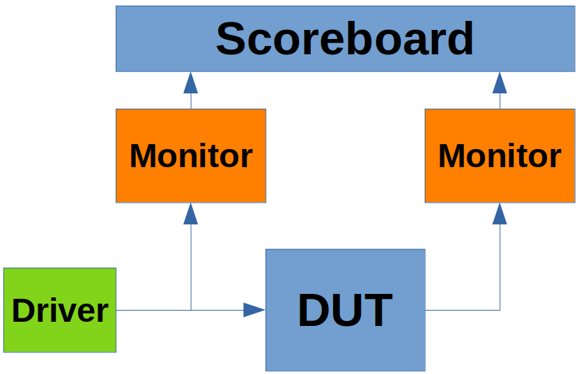

# Layered Testbenches
Layered testbenches are more complex as compared to directed testbenches. It takes a lot of effort to create these testbenches. However, layered testbenches are preferred over directed testbenches because the different testbench modules can be divided and they can be reused. Layered testbenchs achieve higher coverage as compared to directed testbenches in less time. A layered test bench simple block diagram can be seen in the figure below.

