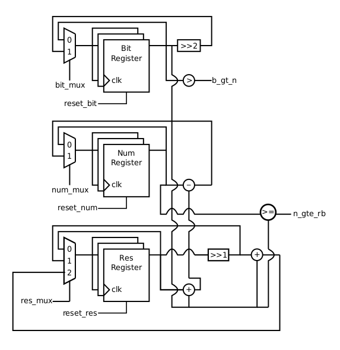

# Task 2: Square Root
For the second task, which was to simulate a sequential circuit we used a square root calculator which takes the input at the positive edge of the ready flag and provides the output when the done flag becomes 1. The calculator implements the Datapath + Controller paradigm.



For the above datapath the controller has the following state transition diagram.


We have the following verilog code for our calculator.
```verilog
module sq_root (
    output reg [15:0] res,output reg done,output reg [3:0] cs,ns,
    input [15:0] num,input clk,reset,ready
);
    // Datapath
    // Bit
    reg bit_mux, reset_bit;
    reg [15:0] bit_shift_2, bit_in, bit1;
    always @(*) begin
        bit_in = bit_mux ? bit_shift_2 : bit1;
    end 

  always @(posedge clk ) begin
     if (reset_bit) begin
         bit1 <= 1 << 14;
     end 
     else begin
         bit1 <= bit_in;
     end
  end

  always @(*) begin
      bit_shift_2 = bit1 >> 2;
  end

  reg b_gt_n;

  always @(*) begin
      b_gt_n = bit1 > num;
  end
  // num
  reg b_ne_z;
  always @(*) begin
      b_ne_z = bit1 != 0;
  end

  reg num_mux, reset_num;
  reg [15:0] n_m_rb, num_in, num1;
  always @(*) begin
      num_in = num_mux ? n_m_rb : num1;
  end

  always @(posedge clk ) begin
      if (reset_num) begin
          num1 <= num;
      end
      else
          num1 <= num_in;
  end

  reg [15:0] res_p_bit;
  always @(*) begin
      n_m_rb = num1 - res_p_bit;
  end

  //res
  reg [1:0] res_mux;
  reg reset_res;
  reg [15:0] res_in, res1, res1a;
  always_comb begin 
          case (res_mux)
              2'd0: res_in = res;
              2'd1: res_in = res1;
              2'd2: res_in = res1a; 
              default: res_in = res;
          endcase
  end

  always @(posedge clk) begin
      if (reset_res) begin
          res <= 0;
      end
      else
          res <= res_in;
  end

  always @(*) begin
      res_p_bit = res + bit1;
  end

  reg n_gte_rb;
  always @(*) begin
      n_gte_rb = num1 >= res_p_bit;
  end

  always @(*) begin
      res1 = res >> 1;
  end

  always @(*) begin
      res1a = res1 + bit1;
  end


  // Controller
  // State Machine
  parameter s0 = 4'b0000;
  parameter s1 = 4'b0001;
  parameter s2 = 4'b0010;
  parameter s3 = 4'b0011;
  parameter s4 = 4'b0100;
  parameter s5 = 4'b0101;
  parameter s6 = 4'b0110;
  parameter s7 = 4'b0111;
  parameter s8 = 4'b1000;
  parameter s9 = 4'b1001;
  parameter s10 = 4'b1010;
  parameter s11 = 4'b1011;
  // State Resgister

  always @(posedge clk) begin
      if(reset) cs <=  s0;
      else cs <=  ns;
  end
  // Output Logic
      always_comb begin
          case (cs)
          s0: begin
              done = 0;
              bit_mux = 0;
              reset_bit = 1;
              reset_num = 1;
              reset_res = 1;
          end 

          s1: begin
              done = 0;
              bit_mux = 1;
              reset_bit = 0;
          end

          s2: begin
              done = 0;
              bit_mux = 0;
              reset_bit = 0;
          end
          s3: begin
              done = 0;
              bit_mux = 0;
              num_mux = 0;
              res_mux = 2'd0;
              reset_bit = 0;
          end
          s5: begin
              done = 0;
              bit_mux = 0;
              num_mux = 0;
              res_mux = 2'd0;
              reset_bit = 0;
              reset_num = 0;
              reset_res = 0;
          end
          s6: begin
              done = 0;
              bit_mux = 0;
              num_mux = 1;
              res_mux = 2'd0;
              reset_bit = 0;
              reset_num = 0;
              reset_res = 0;
          end
          s7: begin
              done = 0;
              bit_mux = 0;
              num_mux = 0;
              res_mux = 2'd2;
              reset_bit = 0;
              reset_num = 0;
              reset_res = 0;
          end
          s8: begin
              done = 0;
              bit_mux = 0;
              num_mux = 0;
              res_mux = 2'd1;
              reset_bit = 0;
              reset_num = 0;
              reset_res = 0;
          end
          s9: begin
              done = 0;
              bit_mux = 1;
              num_mux = 0;
              res_mux = 2'd0;
              reset_bit = 0;
              reset_num = 0;
              reset_res = 0;
          end
          s10: begin
              done = 1;
              bit_mux = 0;
              num_mux = 0;
              res_mux = 2'd0;
              reset_bit = 1;
              reset_num = 0;
              reset_res = 0;
          end
          default:  done = 0;
      endcase
      end

  // Next State Logic
  always @(*) begin
      case (cs)
          s0: ns = ready ? b_gt_n ? s1 : s3 : s0;
          s1: ns = s2;
          s2: ns = b_gt_n ? s1 : s3;
          s3: ns = b_ne_z ? s5 : s10;
          s5: ns = n_gte_rb ? s6 : s8;
          s6: ns = s7;
          s7: ns = s9;
          s8: ns = s9;
          s9: ns = s3;
          s10: ns = s0;
          default:  ns = s0;
      endcase
  end
  initial begin
      $dumpfile("dump.vcd");
      $dumpvars(0,sq_root);
  end
 endmodule
```
We have the following python model.
```python
def sq_root_model(num:int):
    return int(num ** 0.5)
```
Following python testbench has been created.
```python
import cocotb
from cocotb import clock
import cocotb.triggers
from cocotb.clock import Clock
import random
from sq_root_model import sq_root_model
import logging

@cocotb.test()
async def sq_root_test(dut):
    clock = Clock(dut.clk,10,units="ns")
    cocotb.fork(clock.start())
    for i in range(2):
        await cocotb.triggers.RisingEdge(dut.clk)
        dut.reset=1
    dut.reset=0

    for i in range(1000):
        dut.ready=1
        input_value = random.randint(1,100)
        dut.num = input_value
        await cocotb.triggers.RisingEdge(dut.clk)
        dut.ready=0
        await cocotb.triggers.FallingEdge(dut.done)
        dut._log.info("Square root of %d is %d by python we get %d",int(dut.num),int(dut.res),sq_root_model(input_value))
        assert dut.res == sq_root_model(input_value),"Assertion error at num = {A} we get {B}\
        but model value is {C}".format(A=dut.num,B=dut.res,C=sq_root_model(input_value))
```
We have the following makefile for our project.
```makefile  
TOPLEVEL_LANG ?= verilog
PWD = $(shell pwd)
export PYTHONPATH := $(PWD):$(PYTHONPATH)
VERILOG_SOURCES = sq_root.sv
TOPLEVEL := sq_root
MODULE := test_sq_root
include $(shell cocotb-config --makefiles)/Makefile.sim


.PHONY: clean
clean::
  rm -rf *.vcd *.xml __pycache__ sim_build
```
[Main](README.md)|[Prev](Task1.md)|[Next](Task2.md)
